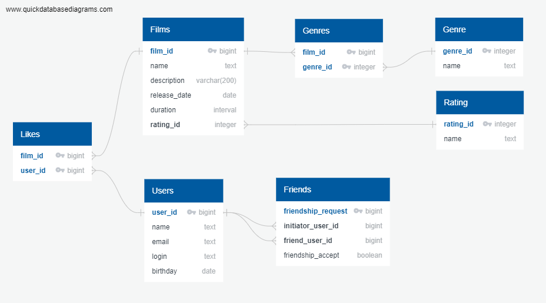

# java-filmorate
Template repository for Filmorate project.



В таблицах Genres и Likes составные ключи из двух полей.

Запрос всех фильмов:
```
SELECT f.film_id,
        f.name,
        f.description,
        f.release_date,
        f.duration,
        r.name
FROM films AS f
LEFT JOIN rating AS r ON f.rating_id = r.rating_id;
```

Запрос всех пользователей:
```
SELECT user_id,
        name,
        email,
        login,
        birthday
FROM users;
```

Запрос топ N наиболее популярных фильмов:
```
SELECT f.film_id,
        f.name,
        f.description,
        f.release_date,
        f.duration,
        r.name
FROM films AS f
LEFT JOIN rating AS r ON f.rating_id = r.rating_id
LEFT JOIN likes AS l ON f.film_id = l.film.id
GROUP BY f.film_id, f.name, f.description, f.release_date, f.duration, r.name
ORDER BY COUNT(l.user_id) DESC
LIMIT N;
```

Запрос списка общих друзей c user:
```
SELECT user_id,
        name,
        email,
        login,
        birthday
FROM users
WHERE user_id IN (SELECT initiator_user_id AS user_id
                  FROM friends
                  WHERE friendship_accept = true
                        AND friend_user_id = user
                  UNION
                  SELECT friend_user_id AS user_id
                  FROM friends
                  WHERE friendship_accept = true
                        AND initiator_user_id = user);
```